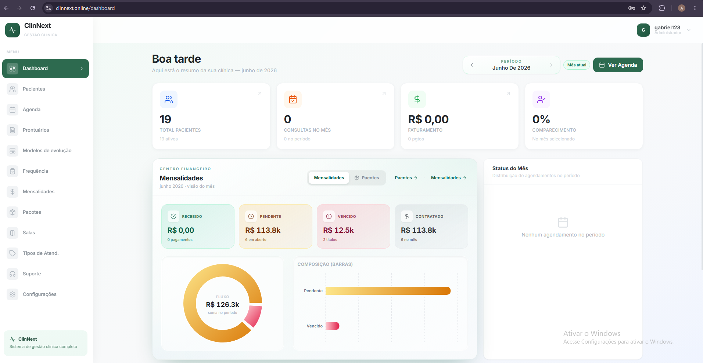
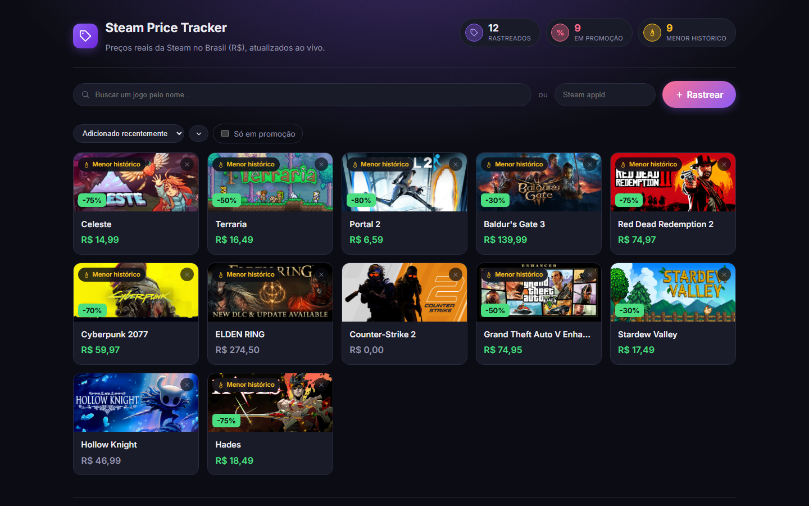

### Olá, sou o Anderson Gabriel 👋

Desenvolvedor Backend focado em **Python, AWS e dados**, atuando no setor de **healthtech** na IntuitiveCare.

**Stack Principal:** Python · AWS (Lambda, ECS Fargate, SQS, EventBridge) · Celery · SQL · SQLAlchemy · Pydantic · Pandas/Polars · pytest · CI/CD · React · Next 

---
### Projetos em destaque:
###  [ClinNext](https://github.com/AndersonGabrielBD/ClinNext)

SaaS completo de gestão para clínicas, do backend à interface — criado pra substituir planilhas e sistemas fragmentados por um fluxo único: agendamento, prontuário, frequência, mensalidades e relatórios.

- **Multi-tenant de verdade**: isolamento de dados por clínica tanto na aplicação quanto via Row Level Security no banco (não só um `WHERE clinica_id = ?` espalhado pelo código).
- **Controle de acesso por papel**: admin, recepção e profissional (fono/médico) enxergam e editam coisas diferentes — prontuário, por exemplo, só o profissional dono do paciente edita.
- Agendamento com validação de conflito de horário, upload/geração de relatórios em PDF, dashboard financeiro completo (mensalidades recebidas, pendentes, vencidas, pacotes).

**Stack:** Flask (Python) + Supabase (PostgreSQL + Row Level Security + Auth) · Next.js 14 + TypeScript + Tailwind CSS

---

### [steam-price-tracker](https://github.com/AndersonGabrielBD/steam-price-tracker)

Rastreador de preços da Steam em tempo real, em reais (R$) — não só mais um CRUD com gráfico.

- **Fila assíncrona de verdade**: Celery + Redis checando preços periodicamente, não um `setInterval` disfarçado — Beat e Worker como processos separados, do jeito que roda em produção.
- **Dado real, não mockado**: histórico de preço importado do IsThereAnyDeal e validado empiricamente contra a API antes de confiar nele; preço atual direto da Steam com `cc=br`.
- **Atualização ao vivo**: preço muda → evento no Redis pub/sub → WebSocket → gráfico atualiza sozinho no React, sem dar refresh.
- **Mentalidade de produção**: health check que testa Postgres e Redis de verdade, cache com fallback gracioso, rate limiting, logging estruturado em JSON — as decisões (o *porquê*, não só o *como*) estão documentadas no README do projeto.

**Stack:** FastAPI · Celery · Redis · PostgreSQL · SQLAlchemy · structlog · React · Recharts · Docker

---

**Outros projetos:** [webscraping](https://github.com/AndersonGabrielBD/webscraping) — pipeline de dados públicos da ANS (scraping, ETL, API) · [ladinpageclinnext](https://github.com/AndersonGabrielBD/ladinpageclinnext) — landing page de vendas do ClinNext

📫 Contato: gaabrieelbarbosaa@gmail.com · [linkedin](https://www.linkedin.com/in/andersongabriel1/)
